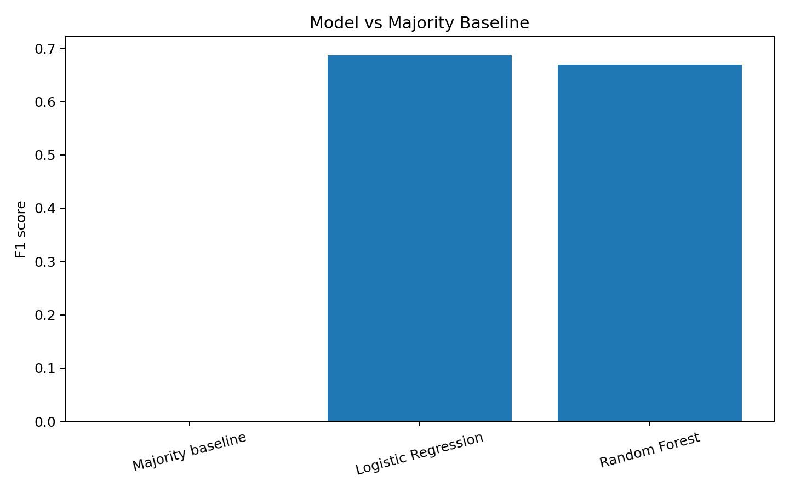
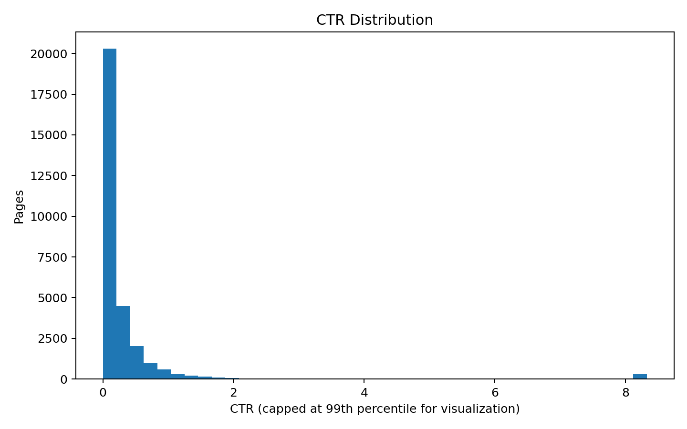

# Search Visibility & CTR Opportunity Scoring

## Abstract

This study asks which content records can be prioritized for review when they combine meaningful search visibility with comparatively low click-through rate (CTR). Using the FlyRank `content_refresh_anonymized.csv` dataset, the analysis defines an opportunity profile from the 75th percentile of 90-day impressions and the median non-zero CTR, then evaluates a leakage-aware classification pipeline. A grouped 80/20 train-test split by client was used, with Logistic Regression and Random Forest compared against a majority-class baseline. Logistic Regression achieved an F1 score of **0.687** and ROC-AUC of **0.967**, while Random Forest achieved an F1 score of **0.670** and ROC-AUC of **0.950**. The resulting score is intended as a decision-support ranking for content review, not as proof of causality or a guarantee of improved Google performance.

## 1. Introduction / Problem Statement

Search visibility and clicks are related but not identical outcomes. A content team may therefore need a repeatable way to identify records that deserve review because they receive meaningful visibility while generating comparatively weak CTR.

**Research question:** Which content records show a combination of high visibility and relatively low CTR, and can a reproducible machine-learning scoring approach prioritize those records for review?

## 2. Data

The analysis uses the supplied FlyRank `content_refresh_anonymized.csv` file.

- Rows: **30,000**
- Columns: **53**
- Unique client groups: **32**
- 90-day impressions 75th percentile: **3,615.25**
- Median CTR among non-zero CTR records: **0.25**

The dataset was checked for duplicate rows and missing values. Missing values were handled inside preprocessing using median imputation for numeric variables and most-frequent imputation for categorical variables.

Client identifiers and content identifiers were not used as model features. Existing outcome/decision flags such as `needs_ctr_fix`, `is_quick_win`, `is_underperformer`, `is_declining`, and `is_initial_refresh_candidate` were excluded to reduce leakage risk.

## 3. Methodology

### Opportunity definition

A record is labelled as an opportunity when:

1. `impressions_90d` is at or above the dataset's 75th percentile; and
2. CTR is greater than zero; and
3. CTR is at or below the median CTR among non-zero CTR records.

This definition creates a practical review queue rather than claiming that a page is objectively underperforming according to a universal benchmark.

### Features

The model uses safe descriptive features such as search volume, competition, CPC, content type, main intent, word count, character count, content age, freshness, days with impressions/sessions, average position, engagement rate, scroll rate, and AI-traffic percentage.

Direct target variables and downstream flags were excluded.

### Validation

An 80/20 grouped split was performed using `client_id` as the grouping variable. This reduces the chance that the same client's distribution appears across both train and test sets.

Models:
- Majority-class baseline
- Logistic Regression with class weighting
- Random Forest with class weighting

## 4. Results

| Model | Accuracy | Precision | Recall | F1 | ROC-AUC |
|---|---:|---:|---:|---:|---:|
| Majority baseline | 0.891 | 0.000 | 0.000 | 0.000 | N/A |
| Logistic Regression | 0.902 | 0.526 | 0.991 | **0.687** | **0.967** |
| Random Forest | 0.893 | 0.504 | 0.997 | 0.670 | 0.950 |

The Logistic Regression model was selected as the final ranking model because it produced the strongest F1 score in the held-out grouped test set while remaining relatively interpretable.

## 5. Ranked Recommendations

The model produces an opportunity probability for each record. The top-ranked records should be treated as a review queue.

Recommended actions:

1. **Low CTR + strong position:** review title/snippet messaging and intent alignment.
2. **Low CTR + high visibility:** investigate whether the search-result message accurately represents the content.
3. **High-visibility informational content:** prioritize review where the content receives substantial impressions but weak click capture.
4. **Older content:** consider freshness/content-review checks when other evidence also indicates an opportunity.
5. **Monitoring:** re-run the score after future data releases; do not interpret a single score as a permanent classification.

The first 50 ranked records are available in `top_50_opportunities.csv`.

## 6. Limitations & Honest Framing

This study is observational. The opportunity label is constructed from the supplied dataset and is not a universal definition of SEO underperformance.

The model does **not** prove Google's ranking algorithm, establish a causal relationship between content changes and traffic, or guarantee CTR improvement. Model probabilities should be interpreted as prioritization scores, not calibrated business forecasts.

The dataset contains aggregated search/content-performance measures and does not provide controlled experiments. Future work could test the ranking approach on later data releases or controlled before/after experiments.

## 7. Reproducibility

The complete notebook is:
`work/capstone_ctr_opportunity.ipynb`

The notebook reads `content_refresh_anonymized.csv`, performs cleaning, leakage-aware feature selection, grouped validation, model training, evaluation, and final ranking.

## 8. Acknowledgments & Data Credit

Built on the FlyRank ML Internship dataset.

Data source: FlyRank AI.

## 9. Submission Checklist

- [x] Capstone lane selected: CTR / Engagement Opportunity Scoring
- [x] Real dataset used
- [x] Leakage-aware feature selection
- [x] Grouped validation
- [x] Baseline comparison
- [x] Model evaluation
- [x] Ranked recommendations
- [x] Limitations and honest framing
- [x] Reproducibility notebook
- [ ] Replace `submission/paper_url.txt` with the final deployed paper URL
